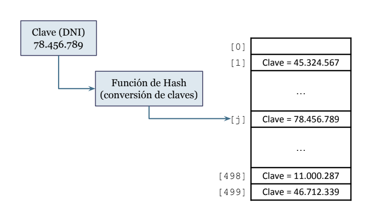
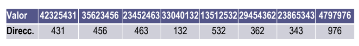
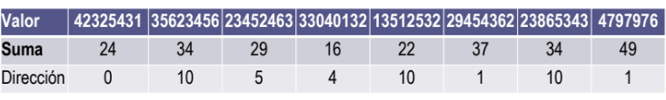
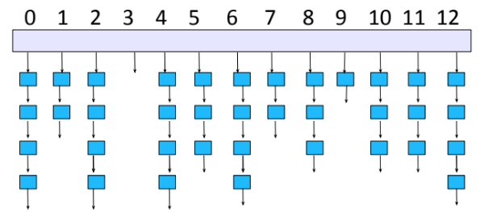
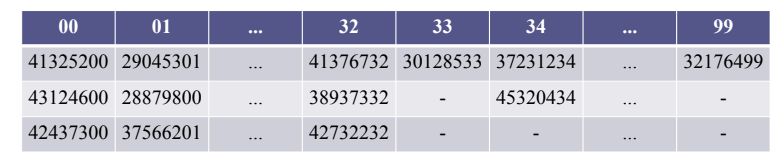
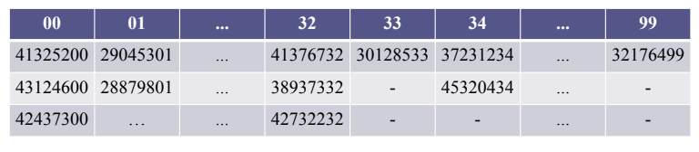

# AyEDA Tema 2

##  Índice 
   > * Búsqueda Secuencial
   > * Búsqueda Binaria
   > * Tabla Hash

### Búsqueda Secuencial

La información se almacena en forma de listas o secuencias de datos o registros.

Generalmente, la búsqueda se realiza sobre un determinado campo de información al que se denomina campo clave.

El modo en que los registros están dispuestos y el método usado para la búsqueda influyen en el rendimiento del programa.

Una secuencia de elementos viene dada por un conjunto finito de elementos dispuestos linealmente uno detrás de otro, de forma que cada elemento tiene un único elemento precedente o anterior y un único elemento siguiente o posterior.

Los elementos pueden ser de cualquier tipo pero para los valores de alguno de sus campos están definidos los operadores relacionales de comparación:

* “<”
* “>”
* “==”

La secuencia tiene siempre:
* un primer elemento, que es el que no tiene anterior, y
* un último elemento que es el que no tiene posterior.

La tarea fundamental entre las operaciones de búsqueda es:

     ● Determinar el elemento o elementos de la secuencia que
         tiene ese valor en el campo correspondiente
     ● O determinar que no existe, en caso contrario.

Búsqueda externa:
* Si existen muchos registros puede ser necesario almacenarlos en archivos de disco externo a la memoria del computador.

Búsqueda interna:
* Los registros que se buscan están almacenados por completo dentro de la memoria del computador.

La búsqueda lineal

* El algoritmo de búsqueda básico de un elemento en una lista, secuencia o vector con una clave dada, conocido como búsqueda lineal o búsqueda secuencial, consiste en:

* * Recorrer sucesivamente los elementos de la secuencia hasta encontrar el elemento buscado o hasta llegar al final de la estructura.

* Se llama búsqueda primaria si el algoritmo se detiene al encontrar el primer elemento con la característica buscada.
* Se llama búsqueda secundaria si se detectan todos los elementos con la característica buscada.

*****************************************************************
```
int bus_primaria(Tdef x, TVector v, int ini, int fin) {
    
       for (int pos = ini; pos <= fin; pos++) {
                if (v[pos] == x)
                return pos;
       }
       return -1;
}
```
*****************************************************************

El algoritmo se detiene al encontrar el primer elemento con valor “x” y devuelve su posición; o el valor “−1” si no existe.

Considerando la cantidad de comparaciones realizadas:

* Mejor caso:
  El elemento buscado está en la primera posición.
* * Se hace 1 comparación.
* Peor caso:
  El elemento buscado está en la última posición.
* * Se hacen n comparaciones (n es el num. de elementos).
* En promedio:
  Si el elemento buscado está en la posición i se hacen i+1 comparaciones; i=0, 1,...n-1.
  El promedio de i = 1, 2, ..., n es: (n+1)/2.
* * Se hacen un promedio de (n+1)/2 comparaciones de elementos.

El tiempo de ejecución:
Depende linealmente del tamaño n de la estructura: O(n)


#### Búsquedas inteligentes

* Si en las búsquedas secuenciales se accede más rápido a los elementos que están en las primeras posiciones: sería conveniente ubicar en las primeras posiciones aquellos elementos que más veces se van a buscar.

* Si se conocen de antemano las probabilidades o frecuencias con las que se va a buscar cada elemento lo ideal es tenerlos ordenados de acuerdo a esas probabilidades o frecuencias: De más frecuente a menos frecuente o probable.

* Si no se conocen esas probabilidades, pero van a ser relativamente estables, se puede tratar de que la propia experiencia permita ir ajustándose a esa situación.

Para ello existen dos estrategias básicas de búsqueda adaptativas:
* Movimiento al frente: Colocar en primer lugar cada elemento buscado.
* Transposición: Intercambiar cada elemento buscado con el anterior.


*****************************************************************
```
int bus_traspuesta(Tdef x, TVector v, int ini, int fin) {
      for (int pos = ini; pos <= fin; pos++)
          if (valor(v[pos]) == x) {
              if (pos == 0)
                 return pos;
              v[pos] = v[pos-1];
              v[pos-1] = x;
              return pos-1;
            }
          return -1;
}
```
*****************************************************************

#### Búsqueda Binaria

La búsqueda secuencial se aplica a cualquier lista o secuencia de elementos 

* Cuando el número de elementos de la lista aumenta, la búsqueda secuencial     tiene muy baja eficiencia.

* Si los elementos de la secuencia están ordenados por la clave la búsqueda, la operación de búsqueda podría ser más eficiente.


* Si la lista está ordenada de acuerdo a la clave de búsqueda, la búsqueda binaria por dicha clave proporciona una técnica de búsqueda mejorada.

* La búsqueda binaria utiliza un método de divide y vencerás para localizar el valor deseado:

* El valor buscado se compara con el valor de la clave del elemento central de la lista.
* De esa forma, se determina si el elemento buscado está en la primera o en la segunda mitad de la lista.
* Se repite el proceso utilizando con la primera mitad o la segunda mitad de la lista; según corresponda.

Ejemplo: Se desea buscar el registro de valor 120 en la secuencia de registros o datos siguiente.

*13 - 44 - 75 - 100 - 120 - 275 - 325 - 510*

* Comparamos la clave buscada con la clave del elemento central de la secuencia:
* * Posición central: 3 (7 / 2 = 3)
* * Valor en la posición central: 100
* Sabremos si el elemento buscado está en la parte anterior o posterior al elemento central.
* La búsqueda se realiza ahora en otra secuencia cuyo tamaño se ha reducido (a la mitad).

Reducción de la secuencia original a 4-7:

*13 - 44 - 75 - 100 - 120 - 275 - 325 - 510*

* Comparamos la clave buscada con la clave del elemento central de la secuencia:
* * Posición central: 5
* * Valor en la posición central: 275
* La búsqueda se centra ahora en la secuencia [4-5] el tamaño se ha reducido a la mitad.

*13 - 44 - 75 - 100 - 120 - 275 - 325 - 510*

* El proceso se itera hasta que no se pueda subdividir más la secuencia (secuencia de un elemento).


*****************************************************************
```
int bus_binaria(Tdef x, TVector v, int ini, int fin) {
      pos = ini;
      while (ini < fin) {
                  pos = (ini + fin) / 2;
                  if (v[pos] < x)
                    ini = pos + 1;
                  else
                    fin = pos;
      }
      if (v[ini] == x) 
        return ini;
      else return -1; 
}
```
*****************************************************************

Mejoras:

* Una mejora práctica en la búsqueda binaria se consigue si se sale del bucle al coincidir uno de los extremos del intervalo de búsqueda con la clave buscada evitando las siguientes particiones.

*****************************************************************
```
int bus_binaria2(Tdef x, TVector v, int ini, int fin) {
       pos = ini;
       while (ini < fin) {
            pos = (ini + fin) / 2;
            if (v[pos] == x)
               return pos;
             else
               if (v[pos] < x)
                 ini = pos + 1;
               else
                 fin = pos - 1;
      }
      if (v[ini] == x)
         return ini;
      return -1;
}
```
*****************************************************************


Considerando la cantidad de comparaciones:

* * El mejor caso: el elemento se encuentra en la posición central de la secuencia.
* El tiempo de ejecución es O(1); sólo se realiza 1 comparación.

* * El peor caso: el elemento no está en la secuencia o se encuentra en la última comparación (se llega a reducir la búsqueda a una secuencia de tamaño 1).
* El tiempo de ejecución es O(log2 n).
* Cada iteración que falla debe continuar disminuyendo la longitud de la subsecuencia por un factor de 2.
* Los tamaños correspondientes son: n, n/2, n/4, n/8, n/16, ... 1
* Esto es: n, n/2, n/2^2, n/2^3, n/2^4, ... n/2^m, siendo m el númerode particiones. Por tanto, si n/2^m= 1, es n = 2^m y m = log2 n.

* * La complejidad resultante es: O(log2 n).

Números de elementos examinados:

| Tamaño  | Binaria | Secuencial |
|---------|---------|------------|
| 1       | 1       | 1          |
| 10      | 4       | 10         |
| 1000    | 11      | 1000       |
| 5000    | 14      | 5000       |
| 100000  | 18      | 100000     |
| 1000000 | 21      | 1000000    |

Número de elementos a comparar en el peor de los casos.

*  En el caso de la búsqueda binaria, tengamos presente, por ejemplo, que 2^10 = 1024, lo cual implica el examen de 11 posibles elementos.   (10+1)

* Si se aumenta el número de elementos de la secuencia hasta 2048 (= 2^11) el número máximo de elementos examinados en la búsqueda binaria es 12. (11+1)

Búsqueda mediante transformación de claves (hashing)

* La búsqueda binaria proporciona un medio para reducir el tiempo de búsqueda pero exige que los datos estén ordenados.
* Existen otros métodos que pueden reducir el tiempo de búsqueda sin necesidad de que los datos estén ordenados:
* Hashing: consiste en convertir la clave dada en una dirección (posición) dentro del vector.
* La correspondencia entre clave y dirección se establece por una función de conversión (la función hash).


#### Tabla Hash

Una tabla de dispersión o tabla hash es un espacio de memoria donde se almacenan registros con información asociada a una serie de valores.

* La idea básica consiste en utilizar una función del valor de referencia que proporcione directamente la posición donde debe estar almacenada la información correspondiente a cada valor.

* A estos registros se accede directamente a través de una dirección de memoria determinada por la función hash del valor de referencia.

* Las tablas hash constituyen una herramienta muy importante para la manipulación y almacenamiento de datos en memoria secundaria.

Ejemplo:

* Empresa con 100 empleados.
* Cada empleado tiene un número de identificación (clave) que va del 1 al 100.
* Puede existir una correspondencia directa entre la clave (número de identificación de empleado) y la posición que ocupa ese empleado dentro del vector de 100 elementos.
* ¿Y si no tuviéramos número de identificación para cada empleado y tuviéramos que usar su DNI? ¿O si el número de empleados fuera elevado?

Ejemplo:
* Supongamos que se quieren almacenar fichas con datos de los alumnos de este curso usando el número del DNI como valor de referencia.
* Dado que estos números tienen hasta 8 cifras, hay del orden de 100.000.000 de valores posibles pero es absurdo reservar memoria para todos si sabemos que el
número de alumnos no llegará a los 300.
* Bastaría con reservar memoria para 300, o a lo sumo para 500 fichas.
* El problema de cómo establecer la ubicación de las fichas de datos correspondiente a cada posible valor para que su posterior gestión sea eficiente se resuelve con la implementación de una tabla de dispersión.

##### Esquema de tabla Hash



##### Función de Dispersión:

Una función de dispersión es una función que, aplicada al valor de referencia, proporciona la dirección donde se encuentra la información asociada a dicho valor.
• Dado:
* un conjunto X de valores posibles (claves)
* un conjunto D de direcciones de memoria de una tabla una función de transformación, de dispersión o función hash es una aplicación h:

*h: X -> D*

##### Colisiones:

En la práctica, el número de claves es mucho mayor que el de los datos que realmente se van a almacenar.
* Por tanto, las funciones de transformación que se puedan utilizar serán siempre suprayectivas:
* * Existirán varios valores que se transformarán en una misma posición de memoria y a esos valores se le denominan sinónimos.
* Si en una aplicación aparecen sinónimos se dice que se produce una colisión y, dado que no son totalmente inevitables, se tiene que disponer de una herramienta para tratar estas circunstancias de forma inteligente.


##### Buenas funciones de dispersión

* Una buena función de transformación para una tabla de dispersión debe ser sencilla y rápida de computar.
* Otro aspecto en selección de una función de dispersión es evitar las colisiones.
* * El menor número de colisiones se produce si se utiliza toda la tabla con la misma probabilidad:
* Funciones de dispersión uniformes.
* * En estos casos, el número de sinónimos a cada valor es similar y se consigue repartir en pequeños trozos similares todo el conjunto de claves posibles.
* De ahí el uso del término inglés hashing (desmenuzar)


##### Función de truncamiento:

Se ignora parte de la clave y se utiliza la parte restante directamente como índice.
* Ejemplo:
* * Si las claves son enteros de 8 dígitos y la tabla de transformación tiene 1000 posiciones.
* * Podríamos utilizar el quinto, segundo y primer dígito (desde la derecha) para hacer la conversión.
* * Por ejemplo, el elemento con clave 72.588.495 iría en la posición 895.
* Este método es rápido pero no distribuye las claves de forma uniforme.

##### Función módulo de truncamiento:

Ejemplo:
* Supongamos que para los 300 alumnos del curso decidimos utilizar los tres últimos dígitos del DNI para obtener la dirección de memoria.
* El conjunto de valores posibles son los números de hasta 8 cifras y la función de dispersión proporciona la dirección como un número de 0 a 999.
* La aplicación con los números del DNI podría dar los siguientes resultados:



##### Función Módulo:

La función de dispersión del ejemplo anterior se establece por la fórmula:

h(x) = x mod 1000

* Si todos los números del DNI desde el 0 hasta el 99.999.999 son igualmente probables, la probabilidad de cada dirección de memoria es de 0.001
* La operación módulo es muy frecuente en el diseño de funciones de dispersión.


El resultado de la operación n mod m es el resto entero de la división del número entero n entre m, que también tiene que ser entero:

n mod m = n % m

* En general, en las tablas de dispersión, se utiliza como valor de referencia de los elementos de la tabla una información numérica de un rango de variación mucho mayor que el tamaño de la tabla de dispersión a utilizar.

* Una vez fijado el tamaño t de la tabla, la función de dispersión se aplica calculando el resto de dividir la clave x por t para obtener la dirección de memoria correspondiente.
* La función de dispersión h(x) = x mod t da un valor entre 0 y t–1 para la dirección de memoria.
* Si el espacio de direcciones de la tabla es de la forma 1, 2, ..., t hay que usar la función de dispersión: h(x) = 1 + (x-1) mod t.

##### Tamaño de la tabla:

* Para usar funciones de dispersión de este tipo hay que analizar la elección del tamaño t ya que se puede tener un gran desequilibrio.
* Esto ocurre, por ejemplo, si las claves son frecuentemente números acabados en 0 y se toma t = 10.
* Algo parecido ocurre si las claves son cadenas de caracteres de palabras de un idioma concreto que tienen inicios o terminaciones muy frecuentes.
* Este fenómeno se presenta con mayor probabilidad cuando el tamaño de la tabla es un número entero con muchos divisores.
* Por tanto, una condición previa que evita ésta y otras dificultades es tomar como tamaño t un número primo, o con pocos divisores.

* Si el tamaño de la tabla puede alcanzar las 1000 direcciones se elige 997 como valor de m.
 Tomando los números de DNI del ejemplo anterior:
h(42325431) = 42325431 % 997 = 787
h(35623456) = 35623456 % 997 = 646
h(23452463) = 23452463 % 997 = 32
h(33040132) = 33040132 % 997 = 549
h(13512532) = 13512532 % 997 = 191
h(29454362) = 29454362 % 997 = 988
h(23865343) = 23865343 % 997 = 154
h(41797876) = 41797876 % 997 = 645

##### Función Suma

Es muy frecuente que las claves estén formadas por cadenas de caracteres, como nombres o identificadores.
* Una opción inmediata para estos casos es usar los valores ASCII de los caracteres para obtener una cantidad numérica, por ejemplo sumándolos, a la que se le aplica una operación aritmética.

************************************************************************************
```
int hash(int valor) {
  d = 0 ;
  x = valor;
  while (x > 0)
   {
       y = x % 10;
       d = d + y;
       x = x / 10;
    }
    return (d % t);
}
```
************************************************************************************

##### Función Suma, Ejemplo:



Aplicando la función hash de tipo suma a los números del DNI con una tabla de tamaño 12 se podría obtener, por ejemplo, lo siguiente:

* Se observan en esta tabla diversos sinónimos correspondientes a las direcciones 10 y 1:
* * Al considerar estas claves se producirán colisiones.
* Parece que el ejemplo está forzado para que aparezcan muchas colisiones (en este caso, 3 colisiones con 8 registros)
* Sin embargo, las colisiones suelen ser más frecuentes de lo que uno espera.

##### Función de Plegado:

Otro tipo de transformación corriente para claves consistentes en secuencias de caracteres es el de las transformaciones denominadas de plegado.
* La idea consiste en dividir la clave en partes de tamaño similar y sumarlas.
* * Esta suma se puede hacer directamente o uniendo los extremos consecutivos con un efecto acordeón.
* Resultan los métodos de:
* * Plegado por desplazamiento
* * Plegado por las fronteras
* Las operaciones pueden hacerse en base decimal o binaria.


* * Si los plegados superan el rango de la tabla se toma el módulo del tamaño de la tabla.

* Plegado por desplazamiento:

h(42|325|431) = 42 + 325 + 431 = 798 |  h(35|623|456) = 35 + 623 + 456 = 1114 → 114
h(23|452|463) = 23 + 452 + 463 = 938

* Plegado por las fronteras:

h(42|325|431) = 42 + 523 + 431 = 996 | h(35|623|456) = 35 + 326 + 456 = 817
h(23|452|463) = 23 + 254 + 463 = 740

Función centro del cuadrado

Otra función de dispersión común para claves de tipo numérico consiste en tomar unos dígitos fijos del interior del cuadrado del número entero.
* Ejemplo:
* * Tomando los DNIs del ejemplo anterior para obtener una dirección del rango 0..999 se toman las cifras tercera, cuarta y quinta del cuadrado de la clave.

42325431 → 42325431^2 = 1791442109335761 → 914
35623456 → 35623456^2 = 1269030617383936 → 690
23452463 → 23452463^2 = 550018020766369 → 1
33040132 → 33040132^2= 1091650322577424 → 916

##### Numeros pseudo-aleatorios

Un tipo de funciones de dispersión con buenas propiedades son las funciones de dispersión o funciones hash pseudo-aleatorias que utilizan las técnicas de los
generadores de números pseudo-aleatorios.
* Estos generadores se basan en una fórmula que aprovecha el rebosamiento en los cómputos en el ordenador.
* Las fórmulas usuales que aplican los generadores de números pseudo-aleatorios de los lenguajes de programación estándares son fórmulas recursivas del tipo:

Semilla = ((multiplicador * semilla) + sumando ) mod máximo

##### Generacion de numeros pseudo-aleatorios

En C++ se dispone de la función rand que proporciona un número entero entre 0 y RAND_MAX.
* El valor de RAND_MAX viene definido en la librería <cstdlib> y suele ser 32767 o mayor.
* Para obtener un número real pseudo-aleatorio entre 0 y 1 con distribución uniforme se usa la fórmula:

```
r = rand() / máximo
```

* Para obtener un número entero entre 0 y n–1 con función de probabilidad uniforme se usa:

```
x = rand() % n
```

##### Inicializar la semilla

La semilla se puede iniciar en un valor concreto en la ejecución de un programa mediante una sentencia:

```
srand(semilla)
```

* Para asignar a la semilla un valor usando el estado del reloj del sistema se usa
```
srand(time(NULL))
```

* Esta sentencia que hace que los valores que proporciona rand() sean prácticamente irrepetibles.
* Si siempre se proporciona el mismo valor semilla, se obtendrá siempre la misma secuencia de números.

##### Función pseudo-aleatoria

Para construir una función hash o función de dispersión pseudo-aleatoria se hace intervenir la clave en la asignación de un valor a la semilla y luego se toma el módulo del tamaño de la tabla para llevarlo a su rango.
* Si las claves de los elementos a insertar en la tabla son identificadores se deben obtener valores numéricos a partir de sus caracteres.
* * Por ejemplo, se pueden transformar en enteros sumando los valores ASCII de algunas de sus letras (o de todas).
* Entonces esta información numérica se utiliza para establecer el valor de la semilla.

##### Código de la función pseudo-aleatoria

Una implementación de la función hash o función de dispersión pseudo aleatoria es:
```
int hash(int valor) {           	No es conveniente usar semillas pares.
      srand(valor);
      return rand() % t;
}
```

##### Implementación de las tablas

El tipo de datos abstracto tabla hash constituye uno de los tipos de datos de mayor aplicación.
* Este tipo de datos, denominado tabla, está compuesto de un número de pares consistentes en:
* * Una clave
* * Un enlace a un registro con cierta información
asociada a la clave.
* La estructura de datos de la tabla hash está compuesta por un número fijo de celdas que pueden estar vacías o contener uno o varios pares.

##### Sinónimos y colisiones:

A las celdas se accede mediante una dirección de memoria que resulta de aplicar una función hash, de transformación o de dispersión h() a la clave:

*h: x → h(x)*

* Dos claves distintas x e y son sinónimas para la transformación si h(x) = h(y)

* Se produce una colisión cuando aparecen dos claves distintas a las que le corresponde la misma dirección.
* * Siempre existe la posibilidad de que aparezcan sinónimos y, por tanto, de que se produzcan colisiones.
* * Por tanto, hay que disponer de herramientas para tratar las colisiones de forma inteligente.

##### Operaciones en las tablas

Sobre las tablas de dispersión se consideran las operaciones básicas siguientes:
* La búsqueda es la operación más relevante y el objetivo fundamental de esta herramienta es hacerla muy eficiente.
* La inserción debe diseñarse de forma que favorezca lo más posible este objetivo.
* La operación de eliminación o borrado.
* Las tablas de dispersión son ineficientes para otras operaciones que requieran información sobre alguna ordenación de los datos:
* Por ejemplo, para obtener un listado de los registros ordenados por su clave.

##### Dispersión abierto o cerrada

Las celdas de la tabla pueden tener capacidad para almacenar:
* * un registro con su clave,
* * un número fijo de ellos, o
* * una cantidad arbitraria.
* Si en cada celda se tiene espacio para una cantidad fija (uno o más) de registros se habla de bloque.
* * Dispersión (hashing) cerrada o direccionamiento abierto.
* Para disponer de espacio para una cantidad arbitraria de registros se usan listas enlazadas mediante memoria dinámica:
* * Dispersión (hashing) abierta, direccionamiento cerrado o encadenamiento separado.

##### Dispersión abierta

La dispersión abierta consiste en usar una lista con los elementos que se dispersan en cada dirección.
* Cada celda de la tabla está compuesta por una clave y un puntero.
* El puntero de una celda apunta a NULL si la celda está vacía.



##### Dispersión cerrada:

En la dispersión cerrada en cada dirección hay una celda que tiene espacio para una cantidad fija de registros (bloque).

* Se produce un desbordamiento en estas tablas al tratar de insertar un nuevo registro con una clave a cuya dirección de memoria le corresponde una celda que ya está completa.
* * El desbordamiento no se produce si se usa dispersión abierta
* Si las celdas sólo tienen capacidad para un registro, que es la implementación más sencilla, la colisión y el desbordamiento se producen a la vez.
* * En este caso se habla de tablas simples, o con celdas simples.

##### Tratamiento del desbordamiento

El tratamiento del desbordamiento implica utilizar una estrategia para determinar un lugar alternativo donde ubicar la información correspondiente y luego poder acceder a ella eficientemente.

* En la dispersión cerrada, si al tratar de insertar un elemento, la celda que le corresponde está llena (hay desbordamiento) se puede tratar de almacenar el elemento en otra celda con algún registro libre.
* * Por ello, se habla de direccionamiento abierto.

##### La exploración

El proceso para determinar qué otra celda se examina para tratar de insertar en ella el elemento se llama exploración.
* La estrategia de exploración debe estar completamente determinada a partir de la clave para que el posterior proceso de búsqueda pueda encontrar eficientemente el mismo registro dada su clave.
* La estrategia de exploración elemental es la exploración lineal:
* * Consiste en probar en las celdas que vienen a continuación hasta encontrar una celda con un registro libre.

##### Ejemplo de Exploración Lineal

Ejemplo: Para los 200 alumnos del curso utilizamos los dos últimos dígitos del DNI.
* El conjunto de claves posibles son los números de 8 cifras y la función de dispersión es la que toma los dos últimos dígitos:
h(x) = x mod 100
* Si la tabla tiene 100 celdas de 3 registros cada una, el estado de la tabla puede ser:



Las claves 37231234 y 45320434 son sinónimos y produjeron una colisión.
* Sin embargo, han podido almacenarse en la dirección que les corresponde.
* La clave 34286434 daría lugar a otra colisión pero no a un desbordamiento.
* Las claves 41376432, 38937132 y 42732432 son sinónimos y sus registros ocupan completamente la celda correspondiente

Seguramente esto fue lo que ocurrió en las celdas 00 y 01:
* Cuando se insertó el registro de clave 28879800 ya estaba llena la celda de dirección 00.
* Posteriormente se insertó el registro de clave 37566201.
* Si ahora se tiene que insertar un elemento con clave 24874700 llevaría a buscarle ubicación en una celda más alejada.

##### Celdas Vacías

Por otro lado, es necesario conocer cuándo el espacio para un registro en una celda está vacío y no confundir el valor que pueda estar presente previamente en la posición correspondiente a la clave con una clave de un elemento ya insertado.
* Un valor especial de la clave (usualmente 0 o –1) indicará que el registro está vacío.
* * Si, por ejemplo, este valor es el cero entonces el cero no puede ser un valor posible de la clave.

La tabla vacía debe inicializarse con este valor en todos sus registros y no dejar en ellos los valores que pudieran haber al iniciar el programa.

##### La Búsqueda 

La búsqueda del registro correspondiente a un valor de la clave se efectúa de la siguiente manera:
* Se empieza por la dirección que le corresponde según la función de dispersión que se esté aplicando.
* Si el valor no se encuentra en ningún registro de dicha celda y queda aún espacio para almacenar el registro, la búsqueda finaliza en fracaso y se puede concluir que el elemento no está presente en la tabla.
* Si el valor no se encuentra en ningún registro de dicha celda y la celda está completamente ocupada, se debe continuar la búsqueda por las direcciones en la que se habría almacenado siguiendo la estrategia de direccionamiento o exploración adoptada.

##### La inserción

Por ejemplo, si la tabla se gestiona con exploración lineal se recorren las celdas que vienen a continuación hasta encontrar el elemento buscado o una celda con espacio para el registro.
* La tabla se considera que es circular por lo que si se llega al final de la misma se vuelve a empezar por el principio.
* Sólo si la exploración acaba en una celda con espacio libre se podría concluir que el elemento buscado no está presente en la tabla.
* Para insertar un nuevo elemento en la tabla, este proceso de búsqueda acaba en la celda con espacio disponible, en la que se puede insertar el registro.

##### La eliminación 

Si se elimina algún elemento de la tabla se puede falsear el proceso de búsqueda de aquellos elementos para los que se exploró la celda de ese elemento al buscarle una posición en la que ubicarlo.
Por ejemplo, si:
* al insertar en una tabla simple el elemento A se produce una colisión con el elemento B que ya está en la tabla y
* posteriormente se elimina B,
* cuando se vaya a buscar el elemento A y nos encontremos que la celda que le corresponde hay espacio libre para el registro,
* entonces interpretaríamos erróneamente que A no está presente en la tabla.

##### Tablas Contaminadas

Como remedio se pueden marcar las celdas de las que se ha eliminado algún elemento para que la exploración no se detenga en ellas.
* Para ello se utiliza un valor de clave especial pero distinto al que corresponde a una celda vacía.
* * Por ejemplo:
* * El 0 (cero) para la celda vacía, y
* * el –1 para la que estuvo ocupada y vuelve a estar libre.
* La presencia de celdas que estuvieron ocupadas provoca un esfuerzo adicional en los procesos de búsqueda que se vuelven más ineficientes y se dice que la tabla está contaminada.

##### Reorganización de las tablas

Si el grado de contaminación de una tabla es alto es conveniente reorganizar de nuevo la tabla aplicando la estrategia de inserción a los elementos que forman parte de ella a la tabla vacía.
* Incluso se puede usar información relativa a la frecuencia con la que se accede a determinados elementos para que sean los menos frecuentes los que se vean desplazados al producirse las colisiones.
* Existen estrategias de reorganización que persiguen dinámicamente este objetivo.

##### Tecnicas de Exploracion

El tratamiento adecuado del desbordamiento requiere usar una estrategia inteligente para determinar la celda alternativa donde ubicar el registro.
* Estas estrategias se denominan técnicas de exploración y una de las más sencillas es la exploración lineal.
* Con la exploración lineal:
* * Cuando se produce un desbordamiento se utiliza la siguiente celda con algún hueco.
* * En la inserción, si la celda está llena se pasa a la siguiente hasta encontrar una con hueco.
* * En la búsqueda, si no se encuentra el registro en la celda, se pasa a la siguiente hasta encontrarlo o alcanzar una celda que no esté llena.
* * Al llegar al final de la tabla, se trata como una tabla circular y se reinicia la búsqueda por el principio.

##### Función de exploración

Si en una tabla T la función de dispersión es h, para una clave x, se examinan las celdas:

* T[h(x)], T[h(x)+1], T[h(x)+2], ..., T[h(x)+i], ...

* En general, la dirección de exploración se expresa por: d = h(x) + gi(x) donde h(x) es la función de dispersión y gi(x) es la función de exploración o de tratamiento de colisiones.
* Al considerar la tabla siempre circular la dirección de exploración es: 
d = (h(x) + gi (x)) mod t donde t es el tamaño de la tabla.
* En la exploración lineal, las direcciones de búsqueda vienen dadas por:
d = (h(x) + i) mod t, para i = 0, 1, 2, ..., t–1.

##### Clustering

Sin embargo, con el método de exploración lineal se van llenando celdas muy cercanas.
* Este fenómeno se denomina clustering y provoca ineficiencia en las operaciones de búsqueda posteriores.
* Esta dificultad se evita en parte con la estrategia de exploración cuadrática que utiliza la función:
gi (x) = i^2 , para i = 0, 1, 2, ...
* Si el tamaño de la tabla toma un valor de la forma t = 4j + 3 entonces la versión de la exploración cuadrática que recorre las direcciones h(x), (h(x) + i^2) mod t, (h(x) – i^2) mod t, incluye todas sus direcciones si 1 <= i <= (t–1)/2.
* Con esta estrategia se puede llegar a producir un fenómeno similar al clustering, denominado clustering secundario.

##### Tecnicas de Exploracion

Otra forma de resolver los desbordamientos es utilizando permutaciones del rango de direcciones de la tabla asociadas a cada valor de la clave; es decir de la secuencia [ 0 . . t – 1].
* La técnica de exploración por permutación consiste en obtener a partir de la clave x una permutación p(x) de las direcciones de la tabla en vez de una sola dirección.
* La estrategia de permutación pseudo-aleatoria consiste en generar una permutación p(x) a partir de la clave utilizando números pseudo-aleatorios.
* Una forma sencilla de obtener permutaciones es mediante los recorridos sistemáticos de paso aleatorio.
* * Es la técnica conocida como dispersión doble.

##### Dispersión Doble

En la técnica de dispersión doble, es una estrategia de exploración en la que, ante una colisión, se genera una amplitud de paso por medio de otra función de
dispersión f(x) y se realiza una exploración del resto de la tabla con dicha amplitud de paso: gi(x) = i * f(x), para i = 0, 1, 2, ...,

* Con la estrategia de exploración doble con las dos funciones de dispersión h(x) y f(x) se recorren las direcciones: d = h(x) + i * f(x) mod t, para i = 0, 1, 2, ...,

##### Tamaño Primo de las Tablas

Sin embargo, de esta forma no siempre se obtiene una permutación de todas las direcciones de la tabla:
* Si el paso f(x) resulta un divisor del tamaño t de la tabla, se repiten direcciones antes de recorrerlas todas.
* Por tanto, si el número t es primo estos recorridos no repiten ninguna dirección antes de haberlas recorrido todas.

* Para la exploración doble es necesario elegir como tamaño de la tabla un número primo y así garantizar que no se repite ninguna celda ninguna celda antes de explorarlas todas dando lugar a un recorrido sobre una permutación de las direcciones de la tabla


##### La Redispersión

La técnica de redispersión o rehashing usa una familia de funciones de exploración gi, i = 0, 1, 2, ..., para examinar las direcciones, siendo cada gi una función de dispersión distinta, para cada i.

##### Eficiencia

La eficiencia del tratamiento de la tabla depende de la carga que soporte la tabla en cada momento.
* Se llama densidad de carga al cociente entre el número de direcciones que se están utilizando y el número de direcciones posibles: 

Densidad = número de direcciones que se están utilizando / número de direcciones posibles

* * Se llama factor de carga al cociente entre el número de registros almacenados y el número de registros que es posible almacenar en la tabla:

Factor = número de registros almacenados / número de registros que es posible almacenar

##### Ejemplo:

Supongamos que para los 200 alumnos del curso decidimos utilizar los dos últimos dígitos del DNI.
* El conjunto de claves posibles son los números de 8 cifras y la función de dispersión se define de forma que los dos últimos dígitos asignan la dirección de memoria.

* * La tabla consta de 100 celdas de tres registros.



* Si hemos insertado 120 registros usando 70 celdas. La densidad de carga es:

* * 70/100 = 0.7

* El factor de carga es:

* * 120/300 = 0.4

* Si al acabar con los 200 alumnos tuviéramos 80 celdas ocupadas, estos valores serían de 0.8 y 2/3.


