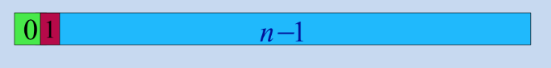

# AyEDA Tema 3

#  Índice
   > * Introduccio a la Ordenacion
   > * Algoritmos Cuadraticos de Ordenacion
        Inserción, Selección, Intercambio
   > * Algoritmos Logaritmicos de Ordenacion
        HeapSort, QuickSort, MergeSort
   > * Otros Algoritmos de Ordenacion
        Incrementos decrecientes, Radicales, TimSort

# Ordenar

* **Ordenar**:
Reorganizar un conjunto de objetos en una secuencia especificada por una **clave**.
* **Objetivo** básico de la ordenación:
Facilitar la **búsqueda** de un elemento dado por su **clave**.
* La ordenación están presentes en **cualquier** contexto;
Se **aprende** antes a ordenar que a contar.
* Los métodos se describen para ordenación **ascendente**;
De menor a mayor clave.

# Clasificación de los métodos.

Según el dispositivo de almacenamiento:

* Los métodos de **ordenación externa**:
Los datos se almacenan en memoria **secundaria**.
* Los métodos de **ordenación interna**:
Los datos se almacenan en memoria **principal**.
Según la forma de abordar la tarea:
* Método de **ordenación directa**:
El método trabaja directamente con los elementos.
* Método de **ordenación por descomposición**:
El método trabaja con partes de la secuencia.

* Método **estable**: no altera el orden **previo** de los elementos de
la secuencia que tienen **igual** valor de la clave.

# Los mejores métodos de ordenación

Calidad de los métodos de ordenación:
Se mide por la **complejidad** algorítmica.

Clasificación:

* **Algoritmos Cuadráticos**: métodos **sencillos** que son **O(n^2)** en tiempo de ejecución.
* **Algoritmos Logarítimicos**: métodos **complejos** que son **O(n log2 n)** en tiempo de ejecución.
* **Otros algoritmos**: métodos mejorados que alcanzan tiempos de ejecución O(n^p) con p↓1 (n es el número de elementos de la secuencia)

# Algoritmos Cuadraticos de Ordenacion

# Inserccion

Se considera la secuencia de elementos a ordenar **dividida** en dos partes:
* Los *i* primeros elementos que **ya** están ordenados
* Los n-i últimos que **no** lo están.


Se comienza desde i = 1



En cada iteración:
* Se toma el elemento que ocupa la posición i y
* Se inserta en la posición (j) adecuada entre los i primeros;


Desde la secuencia

0 ---- 1 ---- j-1 ----- j ---- j+1 ---------- i-1 ------- i ----------- n-1

5 ---- 7 ---- 12 --- 42 ---- 44 -- 55 ---- 94 ------- 18 ----- 06 - 67

Se obtiene la situación:

0 ---- 1 ---- j-1 ----- j ---- j+1 ---------- i-1 ------- i ----------- n-1

5 ---- 7 ---- 12 --- 18 ---- 44 -- 55 --------------- 94 ----- 06 - 67

Ejecución, paso a paso

i = 1 | 44 55 12 42 94 18 06 67 | j = 1

i = 2 | 44 55 12 42 94 18 06 67 | j = 0

i = 3 | 12 44 55 42 94 18 06 67 | j = 1

i = 4 | 12 42 44 55 94 18 06 67 | j = 4

i = 5 | 12 42 44 55 94 18 06 67 | j = 1

i = 6 | 12 18 42 44 55 94 06 67 | j = 0

i = 7 | 06 12 18 42 44 55 94 67 | j = 6

i = 8 | 06 12 18 42 44 55 67 94

# El Codigo

El código del método de ordenación por inserción puede ser sólo:

```c++
for (int i = 1; i < n; i++)
    insertar(sec,i,x);
```

El procedimiento

```c
insertar(sec,i,x)
```

Deberá insertar en la posición adecuada de la secuencia de tamaño i el nuevo elemento x.

# La posicion de insercion 

Para determinar la posición j de inserción, se **recorre** la parte ya ordenada de la secuencia
**comparando** la clave del objeto a insertar con la clave de los elementos de la secuencia.

De forma **ascendente** desde el principio de la secuencia:

```c
j = 0 ;
while ( x > sec[j] )
     j++;
```

De forma descendente desde el índice i,

```c
j = i - 1 ;
while ( x < sec[j] )
     j--;
```

La técnica del **centinela** evita la doble condición de parada:
Se coloca como centinela una copia del elemento a insertar antes de la **primera** posición para que el recorrido se detenga al encontrarla.

```c
sec[-1] = x ;
j = i - 1 ;
while x < sec[j]
     j--;
```

# La insercion

Una vez determinada la posición j de inserción, es necesario **desplazar** la parte de la secuencia entre los índices i y j para dejar **hueco** al objeto a insertar.

```c
for (int k = i-1; k >= j; k--)
     sec[k+1] = sec[k];
     sec[j] = x;
```

Las operaciones de búsqueda descendente de la posición de inserción y la propia inserción **se pueden realizar a la vez**.

# Procedimiento Conjunto

```c
void inserta(Tvector &sec, int i, Tdef x){
     sec[-1] = x;
     j = i - 1;
     while ( x < sec[j] ){
     sec[j+1] = sec[j];
     j--;
     }
     sec[j+1] = x;
}
```

# Inserción con centinela

```c
for (int i = 1; i < n; i++ ){
     j = i;
     x = sec[i];
     sec[-1] = x;
     while ( x < sec[j-1] ){
          sec[j] = sec[j-1];
          j--;
     }
     sec[j] = x;
}
```

# Análisis de la complejidad


Se trata de un algoritmo de complejidad O(n^2).

Hay que realizar n veces la búsqueda de la posición de inserción, que es O(n).

Una **mejora** significativa se obtendría al realizar una **búsqueda binaria** de la posición de inserción.

* Se compara la clave del elemento a insertar con la del elemento **medio** de la secuencia de búsqueda.
* Según que la clave del elemento a insertar sea mayor o menor que la del elemento medio, la secuencia de búsqueda pasa a ser la mitad superior o la inferior de la anterior.

Al procedimiento resultante se le llama **BinSort**

# Procedimiento de BinSort

```c
for (int i = 1; i < n; i++ ) {
     j = i;
     x = sec[i];
     ini = 0; 
     fin = i-1;
     while(ini <= fin) {
          med = (ini+fin)/2;
          if (v[med] < x)
             ini = med+1;
          else
             fin = med-1;
     }
     for (int j = i-1; j >= ini; j--)
          sec[j+1] = sec[j];
     sec[ini] = x;
}
```

## EJEMPLO 

Partiendo de la situación intermedia del ejemplo anterior con el estado de la secuencia parcialmente ordenada siguiente.

12 42 44 55 94 18 06 67

La secuencia de los pasos que sigue el método es la siguiente:

Espacio de búsqueda --------- x ---- ini fin med

12 42 44 55 94 ---------------- **18** -- 0 -- 4 -- 2

12 42 -------------------------- **18** -- 0 -- 1 -- 0

--- 42 -------------------------- **18** -- 1 -- 1 -- 1


12 18 42 44 55 94 ------------- **06** -- 0 -- 5 -- 2

12 18 -------------------------- **06** -- 0 -- 1 -- 0

12 ------------------------------ **06** -- 0 -- 0 -- 0

06 12 18 42 44 55 94 ---------- **67** -- 0 -- 6 -- 3

------------- 44 55 94 ---------- **67** -- 4 -- 6 -- 5

-------------------- 94 ---------- **67** -- 6 -- 6 -- 6

# Compeljidad de BinSort

Si la **búsqueda binaria** en la secuencia de tamaño n emplea un tiempo **O(log n)** y se realiza una búsqueda binaria
en la parte de la secuencia ordenada, el algoritmo BinSort es **O(n log n)**.

* Sin embargo, un análisis cuidadoso de la implementación anterior muestra que este algoritmo es **O(n^2)**.
* Observando el procedimiento de la ordenación **BinSort** anterior se deduce que, aunque la **búsqueda binaria** es **O(log n)**, se aplica un procedimiento **O(n)** para **dejar hueco** al elemento a insertar.

# El analisis detallado

En particular, un análisis detallado del bucle **while** interno muestra que el número de divisiones (y comparaciones) máximo en la iteración i es log i = O(log n).

A continuación se ejecuta un bucle **for** en el que el número de asignaciones máximo en la iteración i es i = O(n).

Por tanto el número máximo total de divisiones y comparaciones es: n O(log n) = O(n log n),

pero el número máximo total de asignaciones realizadas es: **O(n^2).**

# Implementación óptima de BinSort

* Con la secuencia representada por una lista enlazada, como la descrita anteriormente, se evita el bucle **for** y el número de asignaciones también sería O(n log n).

* Sin embargo, la búsqueda binaria tal como se ha expuesto aquí, está implementada para una secuencia representada por **array** lo que permite acceder en tiempo O(1) al elemento medio, lo que no puede realizarse con la lista.

* Para obtener una implementación del algoritmo de ordenación por inserción de complejidad O(n log n) debe hacerse uso de un *árbol binario de búsqueda* para mantener la parte ordenada de la secuencia.


# Seleccion

# Ordenación por selección

En el método de ordenación por selección (igual que en el método de ordenación por inserción) se considera que, en una situación intermedia
* los i primeros elementos **ya** están ordenados y
* los n-i últimos **no** están ordenados.


Sin embargo, en la iteración i,
* se **selecciona** la posición j del elemento de **menor** clave, (entre los elementos que están de la posición i a la n-1)
* se intercambian los elementos que están en las posiciones j e i.


En la situación de partida:
* no se asume la ordenación de ningún trozo; i = 0.


En la primera iteración se selecciona el **menor** de **toda** la secuencia


Se selecciona siempre el elemento de **menor** clave de los no ordenados;


* por tanto, en la iteración i, los primeros i elementos, además de estar ordenados, ... **son los i elementos de menor clave**.

# Ejemplo numérico:

La ejecución de un paso:

De la situación:

0 -- 1 -----i-1 --- i ------------- j ---------- n-1

**6** -- **12** ... **18** ---- 44 -- 55 ... 94 **42** 67 ... 84 **87**

se pasa a la situación:

0 - 1 ---- i-1 --- i ----------- j ---------- n-1

**6** - **12** ... **18** --- **42** 55 ... 94 **44** 67 ... 84 **87**

# El código

* Similar al de ordenación por inserción, *reemplazando* el procedimiento de **inserción** por uno de **selección**:
```c
for (int i = 0; i < n-1; i++)
     selecciona(sec,i);
```

* El procedimiento de selección tiene que elegir el elemento de **menor** clave de la parte no ordenada de la secuencia (desde la posición i hasta el final) e **intercambiarlos**.
```c
for (int i = 0; i < n-1; i++){
     min = i;
     for (int j = i+1; j < n; j++)
          if sec[j] < sec[min]
               min = j;
     x = sec[min];
     sec[min] = sec[i];
     sec[i] = x;
}
```

# Análisis del algoritmo

* Tiene dos bucles **for** anidados: se trata de un algoritmo O(n^2).

* Paralelamente al método de ordenación por inserción, se toma un
elemento de la parte no ordenada y se añade a la parte ordenada.

* Sin embargo, en el método de ordenación por inserción, la
selección del elemento a incorporar es trivial mientras que el
proceso inteligente es el de búsqueda de la posición de inserción.

* En el método de selección, la posición de inserción en la parte
ordenada se obtiene directamente y el esfuerzo computacional se
hace en el proceso de selección del elemento a insertar.


# Por Intercambio

# Ordenación por Intercambio

* **Método de la Burbuja**: BubbleSort

* **Método de la Sacudida**: ShakeSort

* En el método de **ordenación por intercambio** se recorre sucesivamente la secuencia **intercambiando** pares de elementos consecutivos desordenados.

* Se van comparando los pares consecutivos de elementos desde el final hacia el principio.
* Al proceso desde la comparación de los dos últimos elementos hasta los dos primeros se le llama **pasada**.
* La secuencia se suele representar verticalmente y se denomina método de la **burbuja** porque parece que hay un elemento que sube como una burbuja.

# Ejemplo

En la primera pasada, que aquí mostramos con la secuencia orientada en vertical, el elemento burbuja es el 06.


# Criterios de Parada

* Si el elemento burbuja topa con uno de menor clave, éste elemento pasa a ser el nuevo elemento burbuja (que puede continuar subiendo) y su posición queda ocupada
por el anterior.

* En cada pasada del método queda colocado el último elemento burbuja.

* El método se termina cuando en una pasada no se modifica la secuencia.

# Las pasadas del ejemplo:

En la segunda pasada del ejemplo, el elemento burbuja es
inicialmente el elemento con clave 18 pero acaba siendo el
elemento de clave 12.

En la tercera pasada el elemento burbuja es el de clave 42

Las siguientes pasadas (en horizontal) son:

06 44 55 **12** 42 94 18 67

06 **12** 44 55 **18** 42 94 67

06 12 **18** 44 55 **42** 67 94

06 12 18 **42** **44** 55 67 94

06 12 18 42 **44** **55** 67 94 --- no cambia

06 12 18 42 44 **55** **67** 94

06 12 18 42 44 55 **67** **94**

06 12 18 42 44 55 67 **94**

# El Codigo
```c
for (int i = 1; i < n; i++){
     for (int j = n-1; j >= i; j--)
          if (sec[j] < sec[j-1]){
               swap(sec[j-1],sec[j]) ;
          }
}
```

¿Podríamos ahorrar comprobaciones si en una pasada completa no se produce ningún intercambio de elementos?

# Elementos pesados

* Si al aplicar el método de la burbuja, sólo está mal colocado un elemento **ligero**, el método acaba rápidamente, aunque esté muy profundo.

* Sin embargo, si sólo está mal colocado un elemento **pesado**, éste se hunde muy lentamente.

# Burbujas y Piedras

El único elemento ligero mal colocado (el 02) sube en una pasada.

06 44 55 12 42 94 18 67 **02**

**02** 06 44 55 12 42 94 18 67

El elemento pesado (el 97) necesita 8 pasadas para colocarse:

**97** 06 44 55 12 42 94 18 67

06 **97** 12 44 55 18 42 94 67

06 12 **97** 18 44 55 42 67 94

06 12 18 **97** 42 44 55 67 94

06 12 18 42 **97** 44 55 67 94

06 12 18 42 44 **97** 55 67 94

06 12 18 42 44 55 **97** 67 94

06 12 18 42 44 55 67 **97** 94

06 12 18 42 44 55 67 94 **97**

# El método de La Sacudida

* Por tanto, este caso se resolvería fácilmente realizando el recorrido en sentido descendente; como una piedra que se hunde en el agua.

* El método de la sacudida evita este fenómeno haciendo recorridos ascendente y descendentes, alternativamente.

* Además, los recorridos pueden empezar debajo del último elemento burbuja y encima del último elemento hundido, acortándose el recorrido.

* A pesar de ello, el algoritmo de la burbuja y el de la sacudida son O(n^2).

# Ejemplo de la Sacudida

La sacudida aplicado al ejemplo anterior acaba en 4 pasadas.

44 55 12 42 94 18 **06** 67

-> *06* 44 55 12 42 **94** 18 67

<- *06* 44 **12** 42 55 18 67 *94*

-> *06 12* 44 **18** 42 55 67 *94*

<- *06 12 18* 42 44 55 67 94

06 12 18 42 44 55 67 94

# El codigo
```c
ini = 1 ;
fin = n-1 ;
cam = n ;
while (ini < fin){
     for (int j = fin; j >= ini; j--)
          if (sec[j] < sec[j-1]) {
               swap(sec[j-1],sec[j]) ;
               cam = j ;
          }
     ini = cam + 1 ;
     for (int j = ini; j <= fin; j++)
          if (sec[j] < sec[j-1]) {
               swap(sec[j-1],sec[j]) ;
               cam = j;
          }
     fin = cam – 1 ;
}
```

# Algoritmos Logaritmicos de Ordenacion

# Algoritmo HeapSort

* Ordenación por selección: **SelSort**

* Estructura de datos muy eficiente: **Heap o montón**

* Ordenación por selección con Heap: **HeapSort**

# Mejorando el algoritmo SelSort

En el algoritmo de ordenación por selección:

* En la iteración i = 0, 1, ..., n+2: se **selecciona** la posición j del elemento con **menor** clave, entre los elementos que están de la posición i+1 a la
n-1, y se intercambian los elementos que están en las posiciones j e i+1.

Es de esperar que, si se utiliza un método inteligente de selección del menor elemento de la parte no ordenada que resulte más eficiente se podría mejorar la complejidad del método de ordenación.

Esta **mejora** significativa se consigue si la secuencia de elementos no ordenados se introducen previamente en un *montón, montículo o Heap* del que posteriormente se van extrayendo ordenadamente.

Esto da lugar al denominado algoritmo **HeapSort** que es O(n log n).


# Concepto de motón o Heap

Se puede implementar de forma más natural con un árbol.

La formalización de **Williams** se implementa en un array *que empieza en 1 en lugar de en 0*

Es una estructura de datos basada en la relación padre/hijo:

* Los hijos del elemento i son los elementos 2i y 2i+1 (si están presentes en el montón).

* El padre del elemento i es i/2 = i / 2, si no es nulo. (el primer elemento es el único que no tiene padre)


Los elementos posteriores a n/2 no tienen hijos:

* Si n es par, el elemento n/2 tiene un sólo hijo; el elemento n.


* Si n es impar, los hijos de n/2  son los elementos n-1 y n.


* El único elemento que no tiene padre es el primero


# Heap ordenado

La noción de ordenación en la secuencia organizada cómo un montón o heap es menos exigente que la noción estándar.

* Decimos que el montón está ordenado si ningún elemento tiene menor clave que su padre.


* Equivalentemente, el montón está ordenado si ningún elemento tiene mayor clave que ninguno de sus dos hijos.

* Una vez que se tiene una secuencia ya ordenada según un montón hasta la posición n, se inserta un nuevo elemento o se elimina un elemento del montón, manteniendo la ordenación.

# Insertar un elemento

El nuevo elemento se **inserta** siempre en la posición n+1 y si hace
falta se sube para mantenerlo ordenado.


Si el elemento queda mal colocado se **sube** intercambiándolo
recursivamente con su padre, mientras haga falta (mientras tenga
menor clave que su padre o se llegue a la raíz).


La inserción de elementos implica **actualizar** el tamaño n del montón; n = n + 1

# Eliminar un elemento

Para eliminar un elemento de un montón ordenado, se intercambia con el último elemento; y


si éste queda mal colocado se sube o se baja, según haga falta (es decir,
hasta que no tenga hijos o de tenerlos, ninguno tenga menor clave).

Para **bajar** un elemento mal colocado se intercambia recursivamente
con el hijo de menor clave, mientras haga falta.


La eliminación de elementos implica **actualizar** el tamaño n del montón. n = n - 1

# Ordenar un Heap

En un montón ordenado el elemento **mínimo** (el de menor clave) está siempre en la primera posición.


Para **ordenar** los elementos de una secuencia por el método de ordenación
por selección con el uso de un *heap* o montón, en una primera fase, se
ordena la secuencia como un montón incorporando al montón los
elementos uno a uno recolocándolo si hace falta.


Luego, en la *segunda* fase, se va seleccionando iterativamente el elemento
de menor clave que será siempre el que está en la raíz o primera posición.


Se reemplaza por el último que, si hace falta se baja

# Ejemplo

En este ejemplo se muestra, en primer lugar, cómo se realiza la fase de introducción de los elementos en el heap.

Se denota por m al elemento que se incorpora al montón y por p al padre del elemento i.

En la segunda fase de extracción, para sacar los elementos del montón en la secuencia ordenada se va extrayendo el primer elemento de forma iterativa, intercambiándose con el último y, si hace falta, se baja.

Se rebaja el tamaño n del montón y se denota por h el hijo del elemento i de menor clave.

------- | 1 | 2 | 3 | 4 | 5 | 6 | 7 | 8 |

m=1 --- **44** 55 12 42 94 18 06 67 -------- i=1 p=0 => colocado

m=2 --- 44 **55** 12 42 94 18 06 67 -------- i=2 p=1 55>=44 => colocado

m=3 --- 44 55 **12** 42 94 18 06 67 -------- i=3 p=1 12<44 => sube

-------- **12** 55 44 42 94 18 06 67 -------- i=1 p=0 => colocado

m=4 --- 12 55 44 **42** 94 18 06 67 -------- i=4 p=2 42<55 => sube

-------- 12 **42** 44 55 94 18 06 67 -------- i=2 p=1 42>=12 => colocado

m=5 --- 12 42 44 55 **94** 18 06 67 -------- i=5 p=2 94>=42 => colocado

m=6 --- 12 42 44 55 94 **18** 06 67 -------- i=6 p=3 18<44 => sube

-------- 12 42 **18** 55 94 44 06 67 -------- i=3 p=1 18>=12 => colocado

m=7 --- 12 42 18 55 94 44 **06** 67 -------- i=7 p=3 06<18 => sube

-------- 12 42 **06** 55 94 44 18 67 -------- i=3 p=1 06<12 => sube

-------- **06** 42 12 55 94 44 18 67 -------- i=1 p=0 => colocado

m=8 --- 06 42 12 55 94 44 18 **67** -------- i=8 p=4 67>=55 => colocado

# Extracciones (I)

------ | 1 | 2 | 3 | 4 | 5 | 6 | 7 | 8 |

n=8 -- **06** 42 12 55 94 44 18 67

n=7 -- **67** 42 12 55 94 44 18 06 ------ i=1 h=2,3 67>12 => baja

------- 12 42 **67** 55 94 44 18 06 ----- i=3 h=6,7 67>18 => baja

------- 12 42 18 55 94 44 67 06 ----- i=7 h=O (14>n=7) colocado

------- 12 42 18 55 94 44 67 06

n=6 -- **67** 42 18 55 94 44 12 06 ----- i=1 h=2,3 67>18 => baja

------- 18 42 **67** 55 94 44 12 06 ---- i=3 h=6 67>44 => baja

------- 18 42 44 55 94 **67** 12 06 ---- i=6 h=O (12>n=6) colocado

------- **18** 42 44 55 94 67 12 06

n=5 -- **67** 42 44 55 94 18 12 06 ----- i=1 h=2,3 67>42 => baja

------- 42 **67** 44 55 94 18 12 06 ---- i=2 h=4,5 67>55 => baja

------- 42 55 44 67 94 18 12 06 ---- i=4 h=O (8>n=5) colocado

------- **42** 55 44 67 94 18 12 06

# Extracciones (II)

------ | 1 | 2 | 3 | 4 | 5 | 6 | 7 | 8 |

------- 42 55 44 67 94 18 12 06

n=4 -- 94 55 44 67 42 18 12 06 ----- i=1 h=2,3 94 >44 => baja

------- 44 55 94 67 42 18 12 06 ---- i=3 h=O (6>n=4) colocado

------- 44 55 94 67 42 18 12 06

n=3 -- 67 55 94 44 42 18 12 06 ----- i=1 h=2,3 67>55 => baja

------- 55 67 94 44 42 18 12 06 ----- i=3 h=O (6>n=3) colocado

------- 55 67 94 44 42 18 12 06

n=2 -- 94 67 55 44 42 18 12 06 ----- i=1 h=2 94>67 => baja

-------67 94 55 44 42 18 12 06 ------ i=2 h=O (4>n=2) colocado

------- 67 94 55 44 42 18 12 06

n=1 -- 94 67 55 44 42 18 12 06 ------ i=1 h=O (2>n=1) colocado

# Inconvenientes

**Inconvenientes** que podrían solventarse:

* En primer lugar, la secuencia queda al final ordenada en *sentido contrario* y hay que invertirla.
* *  Esto se soluciona considerando el orden dentro del montón o heap en sentido inverso; de mayor a menor.

* En segundo lugar, la parte que se considera que inicialmente ya está ordenada es **sólo** la raíz del montón porque no tiene padre.
* * Se puede también empezar suponiendo que los elementos del *final de la secuencia* los que está inicialmente bien ordenados porque no tienen hijos.


# Método de Floyd (HeapSort)

Se parte de que los elementos bien colocados inicialmente son los de **la mitad final** que son padres de elementos que estarían fuera de la secuencia.

El montón se completa incorporando cada vez un elemento a la derecha que es recolocado **bajándolo** si hace falta. De esta forma, tanto al incorporar como al excluir elementos del montón nunca es necesario subir un elemento, sólo bajarlo.

Finalmente, en la segunda fase del método, es siempre un elemento del final del heap (sin hijos) el que se coloca en la primera posición para ser bajado *una y otra vez*. Para solventar esta cuestión no se ha realizado una propuesta satisfactoria.


# Heap ordenado para HeapSort

* El Heap o montón está **ordenado** si ningún elemento: tiene mayor clave que su padre.
* El Heap o montón está **ordenado** si ningún elemento: tiene menor clave que ninguno de sus dos hijos.

Un elemento mal colocado se recoloca bajándolo o subiéndolo recursivamente mientras haga falta:

* Se **baja** intercambiándolo *recursivamente* con su hijo de mayor clave,
* Se **sube** intercambiándolo *recursivamentecon* su padre.


# Insertar y Eliminar

Dada la secuencia ya ordenada según un montón desde la posición i+1 hasta la posición n, se *inserta* el nuevo elemento de la *posición i* y, para mantener la ordenación, se baja mientras haga falta (es decir; hasta que no tenga hijos o, de tenerlos, ninguno tenga menor clave).

Para **eliminar** el primer elemento del montón ordenado, se intercambia con el último elemento; y si queda mal colocado se baja mientras haga falta..

La eliminación de elementos implica **actualizar** el tamaño n del montón.


# Ordenar con Heap

Para **ordenar** los elementos de una secuencia por el método de ordenación por selección con el uso de un **heap**:
En una **primera** fase,
* se ordena la secuencia como un montón
* incorporando al montón los elementos uno a uno
* bajándolo si hace falta.
En la **segunda** fase,
* se va seleccionando iterativamente
* el elemento de mayor clave
* que será siempre el que está en la raíz o primera posición.
Reordenando el montón tras cada eliminación

# Ejemplo de HeapSort

Inserciones:

| 1 | 2 | 3 | 4 | 5 | 6 | 7| 8 |

44 55 12 42 94 18 06 67

44 55 12 **67** 94 18 06 **42**

44 55 **18** 67 94 **12** 06 42

44 **94** 18 67 **55** 12 06 42

**94** **67** 18 **44** 55 12 06 42

Extracciones:

| 1 | 2 | 3 | 4 | 5 | 6 | 7| 8 | ------------ | 1 | 2 | 3 | 4 | 5 | 6 | 7| 8 |

**42** 67 18 44 55 12 06 **94** ------------> **67** **55** 18 44 **42** 12 06 94

**06** 55 18 44 42 12 **67** 94 ------------> **55** **44** 18 **06** 42 12 67 94

**12** 44 18 06 42 **55** 67 94 ------------> **44** **42** 18 06 **12** 55 67 94

**12** 42 18 06 **44** 55 67 94 ------------> **42** **12** 18 06 44 55 67 94

**06** 12 18 **42** 44 55 67 94 ------------> **18** 12 **06** 42 44 55 67 94

**06** 12 **18** 42 44 55 67 94 ------------> **12** **06** 18 42 44 55 67 94

**06** **12** 18 42 44 55 67 94 ------------> 06 12 18 42 44 55 67 94

# Análisis del Algoritmo

El algoritmo **HeapSort**, que implementa el método de ordenación por selección con heap o montón siguiendo la propuesta de Floyd, es **O(n log n)**.

* Sólo se utiliza el procedimiento **baja**, que es O(log n).

* El **número de veces** que se baja un elemento en cada fase es;
n/2 en la primera fase y n en la segunda fase, por tanto en O(n) veces en total.

# El código de baja (Floyd )
```c
void baja(int i; Tvector &sec; int n) {
     while (2*i <= n){
          h1 = 2*i;
          h2 = h1 + 1;
          if (h1 == n)
               h = h1;
          else if (sec[h1] > sec[h2])
               h = h1;
              else h = h2;
          if (sec[h] <= sec[i])
               break;
          else {
               swap(sec[i],sec[h]);
               i = h;
          }
     }
}
```

# El código de HeapSort (Floyd )
```c
void heapsort(Tvector sec; int n) {
     for (int i = n/2; i > 0; i--)
          baja(i, sec, n);
     for (int i = n; i > 1; i--) {
          swap(sec[1],sec[i]);
          baja(1,sec,i-1) ;
     }
}
```


